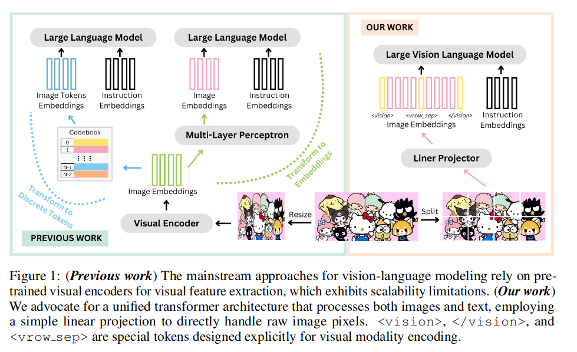
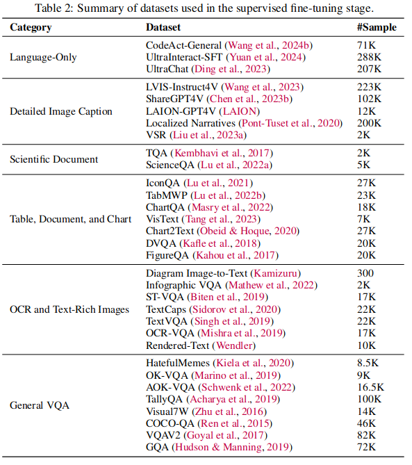
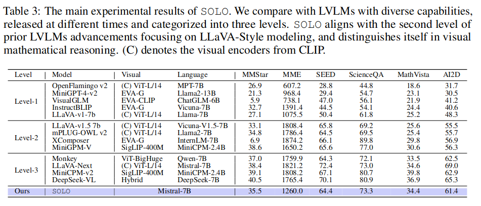

A Single Transformer for Scalable Vision-Language Modeling
======

Yangyi Chen, Xingyao Wang, Hao Peng, Heng Ji

University of Illinois Urbana-Champaign

https://arxiv.org/abs/2407.06438

@cohama

## どんなもの

- Vision-Language モデル (VLM) を1つの Transformer モデルで実現する

## 先行研究と比べて何がすごい?

- 既存の Vision-Launguage モデルは学習済みの画像エンコーダを LLM に接続することで実現されている。
- この方式には4つの弱点がある
  - 画像エンコーダのモデルサイズは pre training 時点で決定されてしまう。大抵の場合 LLM よりパラメータサイズが小さい (1/10) のでパフォーマンス上のボトルネックになりうる
  - 画像エンコーダがあることにより既存の推論用フレームワークやハードウェアの活用が制限される
  - 画像エンコーダがあることによりスケーリング則の解析が難しい。
  - 与えられる画像の解像度が画像エンコーダの pre training の時点で決定されてしまう。たとえばよく使用される CLIP-ViT-336 は画像のサイズが 336x336 の正方形になる。
- これらの問題を解決するために1つの Transformer モデルでテキストと画像を同時に扱えるようにする。
- 同じようなものとして VisualBERT (2019) がある。しかし、当時は大規模なモデルを訓練させるための知見や画像とテキストのバランスを取る手法などがなかった
- VisualBERT を大規模に訓練したものもあるが学習レシピが公開されていない

## 技術や手法の肝は?

### モデルアーキテクチャ

- 画像は固定サイズのパッチにして与える
- 画像のトークン開始時に `<vision>` 終了時に `</vision>` トークンを与える
- 画像のパッチの行が変わるときには `<vrow_sep>` を与える

### 訓練

### Pretrain

1. Stage-1: ImageNet21K を使ってラベルを予測する訓練を行う。ラベルはテキストとして予測する
2. Stage-2: Web-Scale データで追加で訓練し、キャプションを生成させるようにする (Capfusion, CC3M, Websight (HTML コードのデータセット)とそれをレンダリングしたもののペア)
3. Stage-3: アニーリングする。MiniCPM と同様に限定されたデータセットだけを使って訓練する。ノイズの多い Web データを高品質の混合データで学習させる
4. ここまでの学習において、テキストの能力を失わないように一定の割合でテキストのみの訓練も行う。

#### Instruction Tuning

以下のデータセットを使う

※ NVIDIA A100x8 で訓練

## どうやって有効だと検証した？

## 議論はある?

* 7B モデル程度であれば同程度の精度を達成できているが最適な精度にはまだできていない。今後の研究が期待される

## 次に読むべき論文

- VisualBERT (https://arxiv.org/abs/1908.03557)
