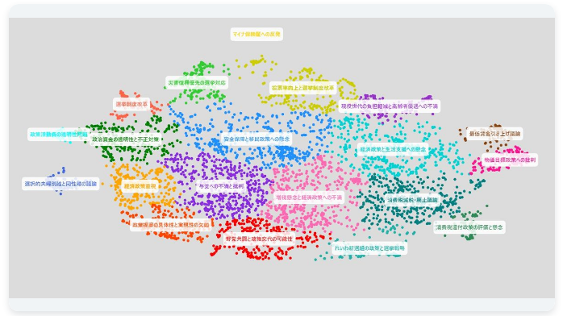
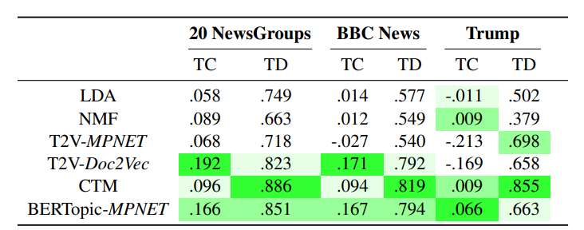
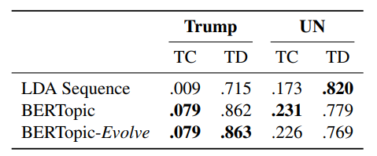

# BERTopic: Neural topic modeling with a class-based TF-IDF procedure
[https://arxiv.org/abs/2203.05794](https://arxiv.org/abs/2203.05794)

(まとめ @n-kats)

著者
* Maarten Grootendorst

# どんなもの？
言語モデルによるエンベディングを使ったトピックモデルを提案。

ブロードリスニングで使われていた([https://news.ntv.co.jp/category/society/1594a26c1d794967a9245ed34e70d681](https://news.ntv.co.jp/category/society/1594a26c1d794967a9245ed34e70d681))。

これを真似てNGKのネタに作ったので読んでみた（なお、読んだ結果、自分の使い方だとBERTopicで処理している部分が意味ないことが分かった）。

# 先行研究と比べてどこがすごい？
言語モデルを使う方法で、競争力のある手法を提案。これによって、将来の言語モデルの性能改善によって、性能改善が期待できる手法を提案。
また、短い文章のような場合でも有力（TF-IDFだと、出てくる単語が少ない影響を受ける）。

# 技術や手法の肝は？
## フレームワーク

* テキストを言語モデルでエンベディング
* エンベディングを低次元に圧縮
* 圧縮したエンベディングをクラスタリング
* クラスベースTF-IDF(提案)をクラスタの特徴量として類似度の高いクラスタを統合する

(＊「どんなもの？」で書いたBERTopicじゃなかったのは、最後のクラスタ統合が効いていない設定だった)

## エンベディング
論文では、Sentence-BERTを使っているが、他のエンベディングも使える。

ブロードリスニングの場合、OpenAIのtext-embedding-3-largeを使っている。

場合によっては、軽い言語モデルを使うこともできる(MiniLM)。

## 低次元圧縮
UMAPを使っている。これがかなり良い手法らしい。

高次元のデータのローカル・グローバルな特徴を保持しつつ、高速に低次元に圧縮できる（詳しくは調べていない）。

エンベディング＋UMAPでクラスタリングする方法を良いことが、[https://link.springer.com/chapter/10.1007/978-3-030-51935-3_34](https://link.springer.com/chapter/10.1007/978-3-030-51935-3_34)で報告されている。

## クラスタリング
HDBSCANを使っている。DBSCANの改良版で、密度がまちまちのデータをクラスタリングしようというモチベーションの手法。

## クラスベースTF-IDFで統合

* $tf_{t,c}$：クラスタ$c$における単語$t$の出現頻度
* $tf_t$：単語$t$の出現頻度
* $A$: クラスタ内の単語数の平均

### 通常のTF-IDF

* $df_t$：単語$t$が出現する文書数
* $N$：文書数

クラスベースTF-IDFは、クラスタの特徴量を求めることが目標で、そこに違いがある。

## 動的トピックモデリング
同じトピックでも時間がたつにつれ出現する用語が変わっていく。これを考慮した方法が動的トピックモデリング。

時点tのクラスベースTF-IDFを使う方法を提案している。

さらに、平滑化を行うことも提案している（しなくてもよい）。

# どうやって有効だと検証した？
## データセット
* 20 Newsgroups
* BBC News
* トランプ氏のツイート（2009年～2021年の44253件）
* 国連総会議事録

## 評価指標
トピック一貫性（TC）とトピック多様性（TD）を評価

* TC: NPMI（正規化自己相互情報量）
* TD: ユニークな単語の割合（トピック単位で？）

## 評価結果

TC/TDともに、BERTopicが優れた評価値を得ている。

### 言語モデルVS古典的手法

古典的な手法でもよさそうだが、トランプ氏のツイートのような短い文章の場合、言語モデルを使ったものが優れている（TC）。

### 動的トピックモデリング

LDA Sequenceより優れていることが確認できるが、BERTopicの動的トピックモデルリング用の工夫にほとんど効果がないこともいえる（やってみたけど意味なかったということ？）。

# 議論はある？
* 軽い言語モデルでもよい。モデルか賢くなったら性能が上がるかも
  * （主張に一貫性が無い？軽くても同じ？賢いのがやっぱいい？）
* 独立したコンポーネントに分かれていて、それぞれをカスタマイズ可能
* クラスベースTF-IDFは、動的モデリング対応しやすく可能性がある
* 文章がひとつのトピックにしか含まれない前提の処理になっている
* トピック表現事態は、単語数ベースの手法（クラスベースTF-IDF）に依存していて、それ由来の問題がある

## 私見
動的トピックモデリングの効果がないのは、最新の言語モデルで評価しているため、古い用語と新しい用語を同等に扱えるためだと思う。

[NGKネタ](https://github.com/n-kats/ngk_2025/blob/main/_report/clustering_summary_openai_4o_embedding_openai_3_large.md)

# 次に読むべき論文は？
* UMAP・・・重要なのはこっちなのでは？（他はあまり重要でないかも）