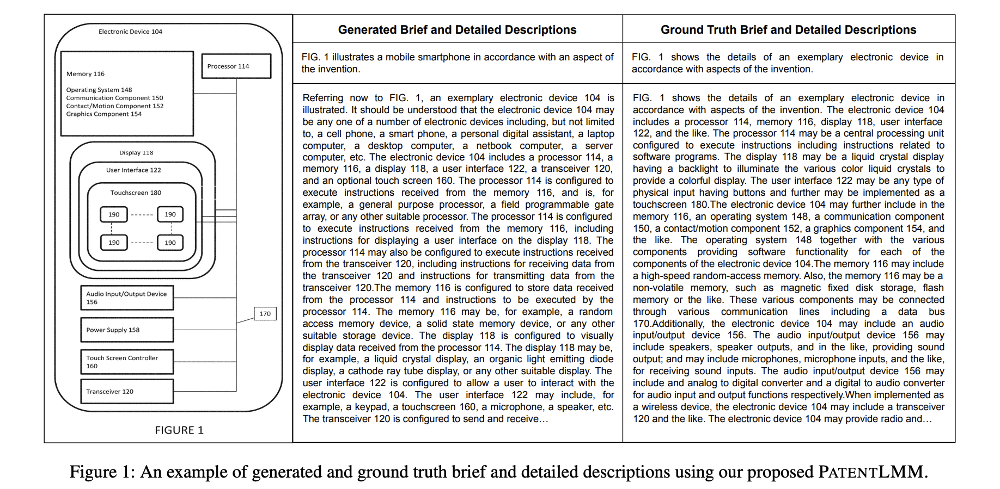
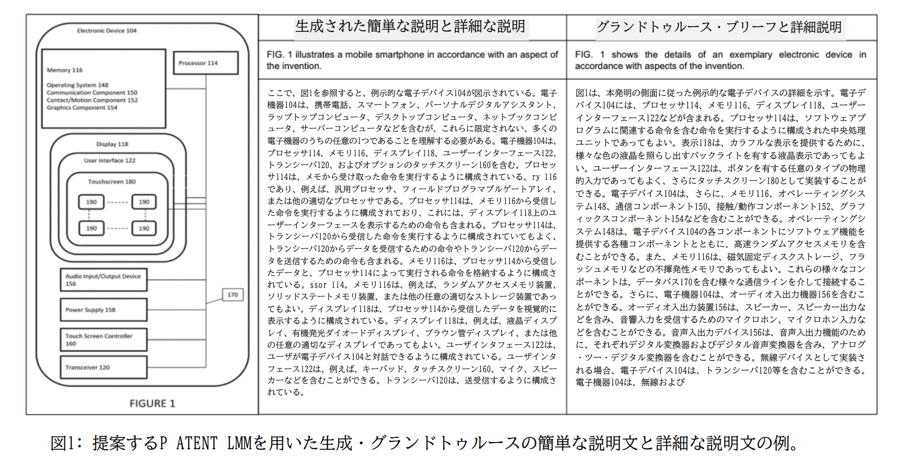
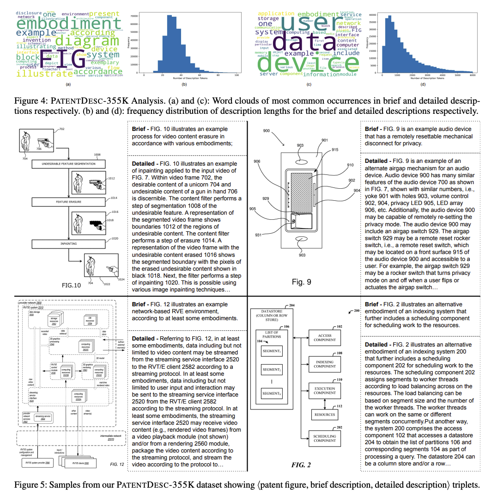
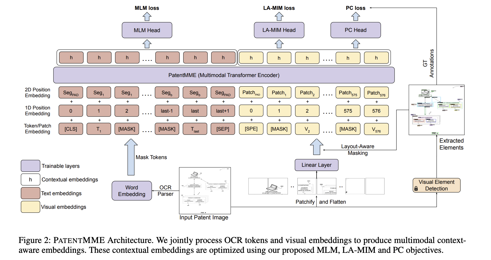
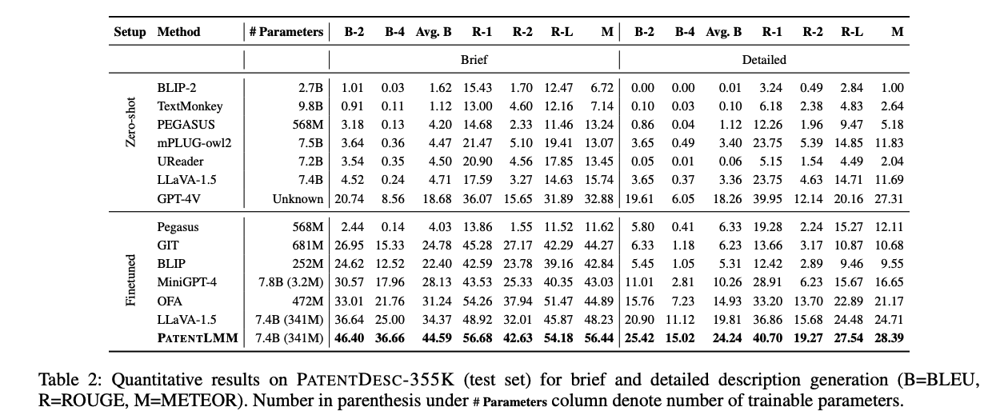
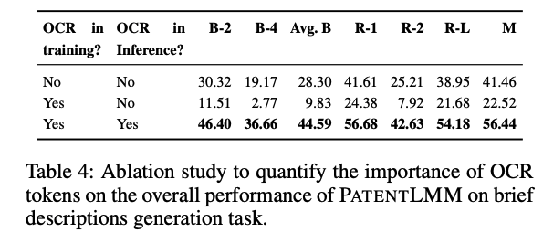
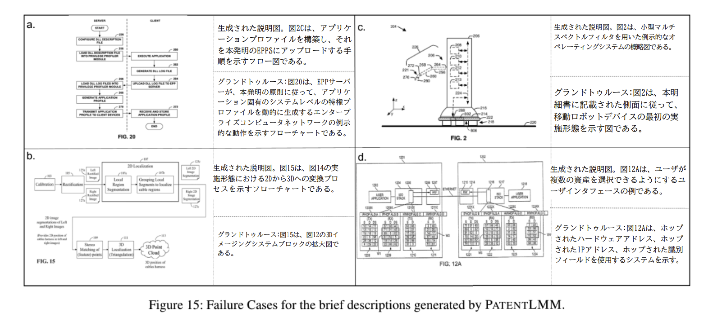
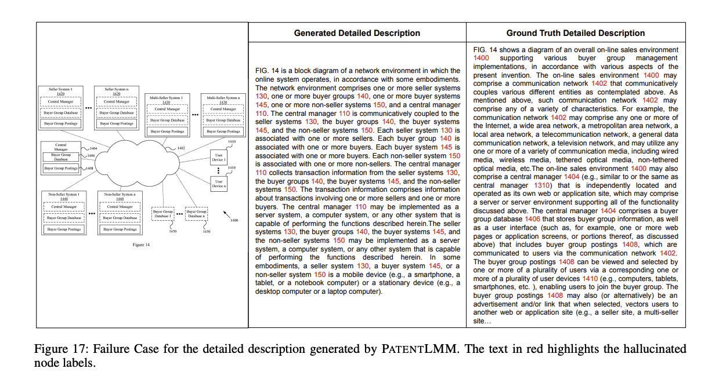
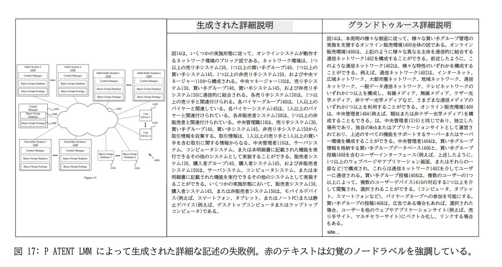

PatentLMM: Large Multimodal Model for Generating Descriptions for Patent Figures
===

https://arxiv.org/abs/2501.15074

Shreya Shukla *1, Nakul Sharma *1, Manish Gupta *2, Anand Mishra *1
- *1 Indian Institute of Technology Jodhpur
- *2 India Microsoft, India

AAAI2025採択論文

（まとめ：Hiroki Narita）

---

## どんなもの？

- 特許図とそれに対する説明を記述した大規模データセット(PATENTDESC-355K)の公開
- 特許図に対するCaptioningタスクを解くLMMの提案(PATENT LMM)

 日本語訳にした図 

## 先行研究と比べて何がすごい？

- [PatFig (Aubakirova, Gerdes, and Liu 2023)](https://arxiv.org/abs/2309.08379)では、17k(Training)、2k(Test)での検証に対して、約20倍のデータセットで検証

- 既存の自然画像や文書を対象としたモデルは、特許図分析特有の、数値から説明文を生成するタスクを解くことが難しい
    - 特許図特有の表現を捉えるアーキテクチャの提案

## 技術や手法の肝は？

### PATENTDESC-355K
- [Google Patents](https://patents.google.com/)から収集されたデータ。専門用語や特許図特有の表現が多い。
- Brief(簡単な説明)、Detailed(詳細な説明)を正解データとして持つ。

### PatentLMM
- VisionEncoderであるPatentMME、Projection Layer(MLP)、TextDecoderとしてのPatentLLaMaで構成される
- 特許文書のデータセットである、[HUPD patent dataset(Suzgun et al. 2024)](https://arxiv.org/abs/2207.04043) 450kによる事前学習 + PATENTDESC-355k datasetによる全体の学習
    
    1. **PATENT MME**をHUPDデータセット+紐づく画像データをWebスクレイピングしてきて、半教師つきで学習させる
    2. **PATENT LLaMA**をHUPDデータセットでLoRA継続学習
    3. **PATENT LLM全体**をPATENTDESC-355Kで学習
    4. **PATENT MME**をfreezingして、**Projection MLP** と**PATENT LLaMA**を学習

### PatentMME
- [LayoutLMv3 (Huang, Yupan, et al. 2022)](https://arxiv.org/abs/2204.08387)とアーキテクチャは同じ。学習方法も似ている。
- MLM loss
    - OCRテキストをマスクして予測
- LA-MIM loss
    - Masked Image Modeling(MIM)をする際に、ノード、ノードラベル、図ラベル、テキスト、矢印の5つの要素のうち少なくとも1つを含む画像パッチのみをマスクして画像内のOCRテキストトークンを予測(LA-MIM loss)。このときにFaster-RCNNベースの物体検出モデルを使う。
- PC loss
    - 物体検出モデルで推論されたラベルを当てるように学習

### PatentLLaMA
- [LLaMA-2(Touvron et al. 2023)](https://arxiv.org/abs/2307.09288) 7BモデルをHUPD patent datasetのテキストで学習
    - LoRA(Hu et al. 2022)を用いて、LLaMa-2 7Bの継続事前学習

## どうやって有効だと検証した？

- PATENTDESC-355Kを用いてLMMにおける主要なモデルと比較。Zero-shot, Finetunedの設定でBrief, Detailedの性能を評価。
- 同等のパラメータ数である、MiniGPT-4、LLaVA-1.5と比較してBriefのBLUEスコアは**約10%**、全体として**約8％**、提案モデルの性能が高い。
- MiniGPT-4やLLaVA-1.5は自然画像で学習されたものに対してFine-tuningしており、特許図や特許文書による事前学習の重要性を示唆している。

---

## 議論はある？

### PATENT MMEのOCRトークンは必要か？

上から、

- PATENT MMEの事前学習にのみ使用し、PATENT LMMの学習に使用しない
- PATENT MMEの事前学習とPATENT LMMの学習に使用するが、推論時には使用しない
- 提案手法

OCR結果をパイプラインで一貫して使うことが一番良いことを示している

### エラー分析
以下の傾向が見られる。

- 図とテキストに対する1対1の対応しかできていないため、他の図やテキストを跨ぐ必要がある場合ミスをする

- 図内にテキストがないとミスをしやすい

#### Brief

 日本語訳にした図 

#### Detailed

 日本語訳にした図 

## 次に読むべき論文は？

- [PatFig (Aubakirova, Gerdes, and Liu 2023)](https://arxiv.org/abs/2309.08379)
    - 特許図に対するCaptioningをしている先行研究
- [LayerX社のLayouLMv3の記事](https://tech.layerx.co.jp/entry/2023/10/02/132854)
    - LayoutLMv3についてわかりやすくまとまっている