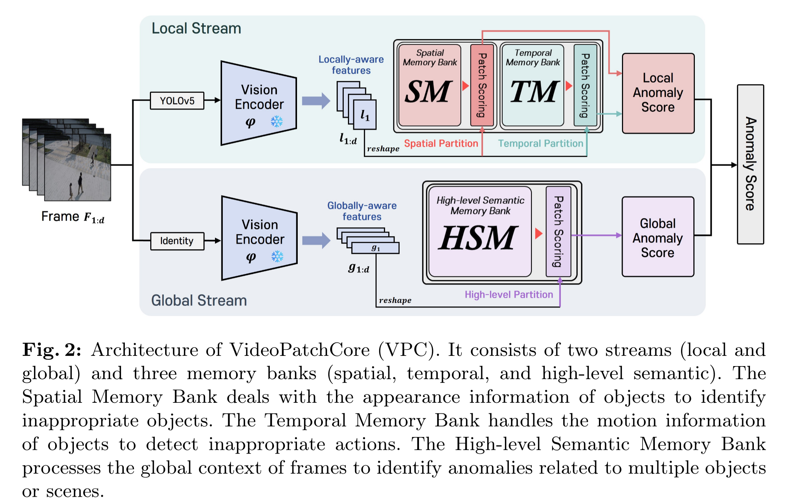
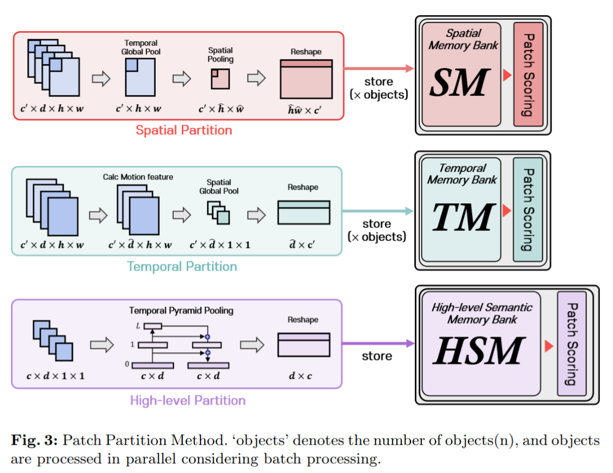
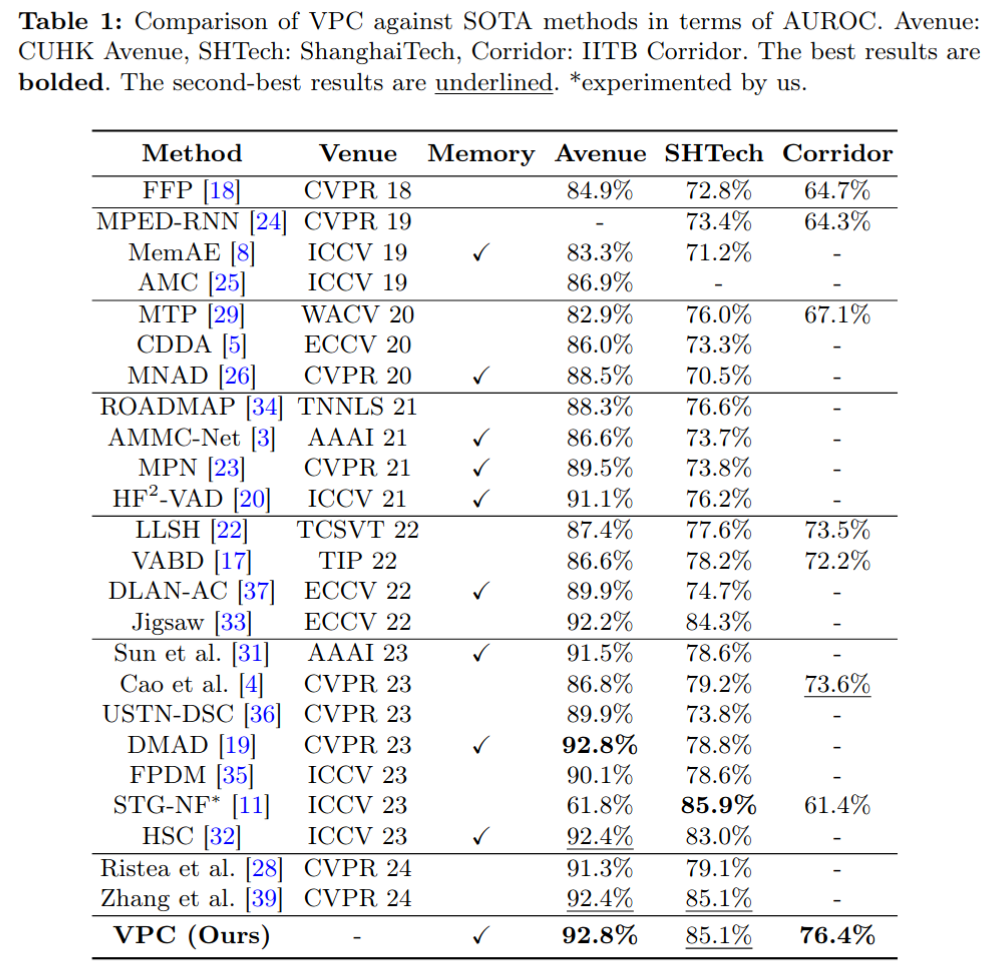

VideoPatchCore: An Effective Method to Memorize Normality for Video Anomaly Detection
=====
https://arxiv.org/abs/2409.16225v5

## どんなもの？
- 動画用異常検知モデルの1つ
- 画像用の異常検知手法である PatchCore を動画に応用
- 空間的な特徴、時間的な特徴、グローバルな特徴に分けてメモリバンクを構築することでリソースを抑えつつ高精度を達成

## 先行研究と比べてどこがすごい？

- 動画の異常検知手法の1つとして再構成または予測を使ったアプローチがある。次のフレームを予測し、その差が大きければ異常のような手法。しかし、モデルが賢すぎると異常なシーンももっともらしく生成してしまう課題がある。
- 近年 (24年当時) の主流な手法はメモリ拡張を使った再構成手法。これは予めエンコーダの出力をメモリに保持しておき、推論時にそれと似た特徴を探してそこから再構成を行うもの。これは精度が高いがメモリ使用量が厳しい。直近ではこのメモリ使用量を削減する研究も行われている。
- VideoPatchCore はこれらとは異なり画像の PatchCore とほぼ同じ手法、つまり正常なデータの特徴をメモリに貯めたあとで subsampling により削減。推論時は単に特徴の距離を測るだけ。

## 技術や手法のキモはどこ？

### 全体

- 動画の各フレームの画像を切り出す
- YOLOv5 で物体検出を行い、各バウンディングを切り出してそれぞれを CLIP (ResNet) で特徴抽出
- 物体ごとの特徴を時間的な特徴ベクトルと空間的な特徴ベクトルに分解する。
- 上記とは別に画像全体の特徴をとり、それの時系列的なベクトルも別途取得する。

### 推論時

- 訓練用の正常データから得られた特徴ベクトルをメモリバンクに格納
- 推論時はテスト動画の特徴ベクトルとメモリバンクの距離を基に以下のように異常度スコアを出す。

## どうやって有効だと検証した？

### ベンチマーク

### Ablation

## 議論はある？

## 次に読むべき論文は？
- Uninformed Students: Student-Teacher Anomaly Detection with Discriminative Latent Embeddings https://arxiv.org/abs/1911.02357
  - Student-Teacher モデル。この手法の先行研究
- PUAD: Frustratingly Simple Method for Robust Anomaly Detection https://arxiv.org/abs/2402.15143v1
  - MVTec LOCO の最先端手法の1つ。
