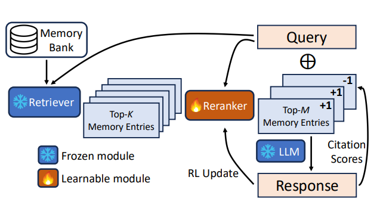
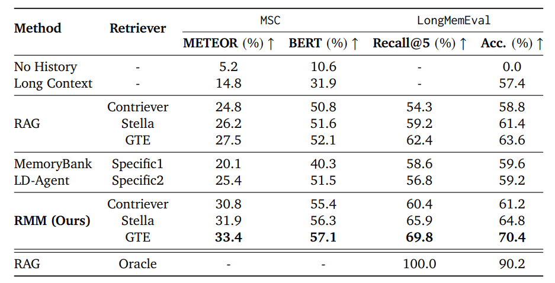
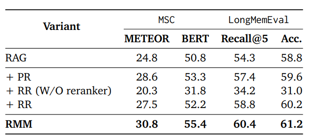
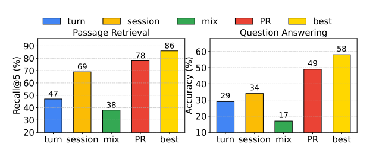

# In Prospect and Retrospect: Reflective Memory Management for Long-term Personalized Dialogue Agents
[https://arxiv.org/abs/2503.08026](https://arxiv.org/abs/2503.08026)

（まとめ @n-kats）

著者
* Zhen Tan
* Jun Yan
* I-Hung Hsu
* Rujun Han
* Zifeng Wang
* Long T. Le
* Yiwen Song
* Yanfei Chen
* Hamid Palangi
* George Lee
* Anand Iyer
* Tianlong Chen
* Huan Liu
* Chen-Yu Lee
* Tomas Pfister

Google Cloud AI Research、Google Cloud AI、アリゾナ大学、ノースカロライナ大学チャペルヒル校のメンバー

# どんなもの？
LLMのパーソナライズに関する論文。

長期的なサービス利用によって大量にユーザーの情報が蓄積されても耐えうるような仕組みを考案。
Prospective ReflectionとRetrospective Reflectionの2つの機構を持つReflective Memory Management（RMM）を提案。


# 先行研究と比べてどこがすごい？
ChatGPTのメモリ機能のようにパーソナライズして、個人の好みに合わせる仕組みがかねてから研究されている。

長期的な利用を想定して、既存手法の以下の課題に注目した。
* メモリの粒度が固定（自然な情報としてメモリに残らない）（メモリの作りが未熟）
* 情報取得の方法（リトリーバー）が固定

それぞれ、Prospective Reflection とRetrospective Reflection の機構を導入して対応。

LongMemEvalデータセットで大幅な改善を達成した。

# 技術や手法の肝は？
## 概要
想定する状況：ChatGPTのスレッドのように会話の塊がある（セッション）。ユーザーの発言とLLMの応答（併せてターン）でセッションが構成される。

以下を実施する。
* リトリーバーのパーソナライズ（Retrospective Reflection）
  * オンラインのリランキングを実施
* メモリ更新（Prospective Reflection）
  * LLMで、新規メモリにするか既存メモリに統合するか判断して更新

## メモリ
メモリバンクは、トピックの要約と元の対話データのペアを要素とするデータとして構築される。

質問とトピックの要約との類似度を使ったRAGを行う。


## Retrospective Reflection（リトリーバーのパーソナライズ）
以下のようなRAGを行う。

1. メモリバンクから類似度の高いトピックを取得。
1. リランカーを使って、より有用性の高いトピックを選択。
1. 回答。ついでに利用したトピックを取得。（同時に行うと良い）
1. リランカーを更新。

リランカー以外は、既存のRAGと同じ。




### リランカー
一つ目の類似度計算では、埋め込みベクトルそのままを用いるが、リランカーモデルでは、埋め込みベクトルを調整して類似度計算する。

* $q'=q + W_{q}q$ （クエリベクトルの調整）
* $m'=m + W_{m}m$ （メモリベクトルの調整）
* $s = q'\dot m'$ で類似度を計算し、温度パラメータつきsoftmaxで確率$p$を計算する。
  * Gumbel Trickというノイズ付与を行う。
  * $s' = s + -\log\(\log u\)$ でノイズを付与する（uは0~1の一様分布からサンプリング）。

### リランカーの学習
$W_{q}$と$W_{m}$を学習する。$(R-b) \log p$  を増やすように1stepの学習を行う。

ただし、Rは報酬で、採用されれたトピックの場合1、それ以外は-1。bハイパーパラメータ。（REINFORCE風の手法）

## Prospective Reflection（メモリ更新）
セッション終了時に、メモリの更新を行う。

1. セッションからトピックの抽出（トピックの要約と参照ターンの番号を抽出（複数可））
1. それぞれをメモリに反映（新規追加 or 既存メモリとマージ）


### トピック抽出のプロンプト
```
Task Description: Given a session of dialogue between SPEAKER_1 and SPEAKER_2, extract the
personal summaries of SPEAKER_1, with references to the corresponding turn IDs. Ensure
the output adheres to the following rules:
• Output results in JSON format. The top-level key is “extracted_memories”. The value
should be a list of dictionaries, where each dictionary has the keys “summary” and
“reference”:
– summary: A concise personal summary, which captures relevant information about
SPEAKER_1’s experiences, preferences, and background, across multiple turns.
– reference: A list of references, each in the format of [turn_id] indicating
where the information appears.
• If no personal summary can be extracted, return NO_TRAIT.
Example:
INPUT:
```

### メモリへの反映のプロンプト

```
Task Description: Given a list of history personal summaries for a specific user and a new
and similar personal summary from the same user, update the personal history summaries
following the instructions below:
• Input format: Both the history personal summaries and the new personal summary
are provided in JSON format, with the top-level keys of “history_summaries” and
“new_summary”.
• Possible update actions:
– Add: If the new personal summary is not relevant to any history personal summary,
add it.
Format: Add()
– Merge: If the new personal summary is relevant to a history personal summary,
merge them as an updated summary.
Format: Merge(index, merged_summary)
Note: index is the position of the relevant history summary in the list.
merged_summary is the merged summary of the new summary and the relevant history
summary. Two summaries are considered relevant if they discuss the same aspect
of the user’s personal information or experiences.
• If multiple actions need to be executed, output each action in a single line, and
separate them with a newline character ("\n").
• Do not include additional explanations or examples in the output—only return the
required action functions.
Example:
INPUT:
• History Personal Summaries:
– {"history_summaries": ["SPEAKER_1 works out although he doesn’t particularly
enjoy it."]}
• New Personal Summary:
– {"new_summary": "SPEAKER_1 exercises every Monday and Thursday."}
OUTPUT ACTION:
Merge(0, SPEAKER_1 exercises every Monday and Thursday, although he doesn’t particularly
enjoy it.)
Task: Follow the example format above to update the personal history for the given case.
INPUT:
• History Personal Summaries: {}
• New Personal Summary: {}
OUTPUT ACTION:
```

# どうやって有効だと検証した？
## 評価設定
パーソナライズのデータセットのMCSとLongMemEvalで評価。

LLMはGeminiを用いる。

## 結果



* No Historyは、メモリを使わない場合。当然、LongMemEvalが0点
* RAGとRMMとを比べると、リトリーバーによらず大きな効果が出ているとわかる。
* Long ContextはGeminiが得意そうだが、実際はRAGに劣り、RMMと大きな差がある。
* リトリーバーが完璧だったらAcc.が90%くらいになるため、リトリーバーの改善が課題。

## アブレーション



RR(W/O reranker)は代わりにretrieverをファインチューニングする。これは逆効果でひどくなる。
## 粒度の効果



このグラフはメモリの粒度を変えた変化を示している。固定粒度（ターン・セッション）よりもprospective reflectionの方が効果がある。

# 議論はある？
* リランキングの学習のコストが問題で、リアルタイムのシナリオでは難しい
* 画像などは未検証
* ユーザーの傾向の変化への対応は未対応
* メモリバンクの構成がプライバシー保護に問題がある

## 私見
セッションの終了はいつ決まる？

# 次に読むべき論文は？
* [MemoryBank](https://arxiv.org/abs/2305.10250)
* [LD-Agent](https://arxiv.org/abs/2406.05925)
