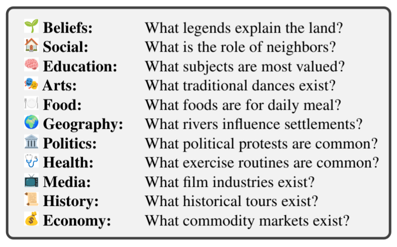
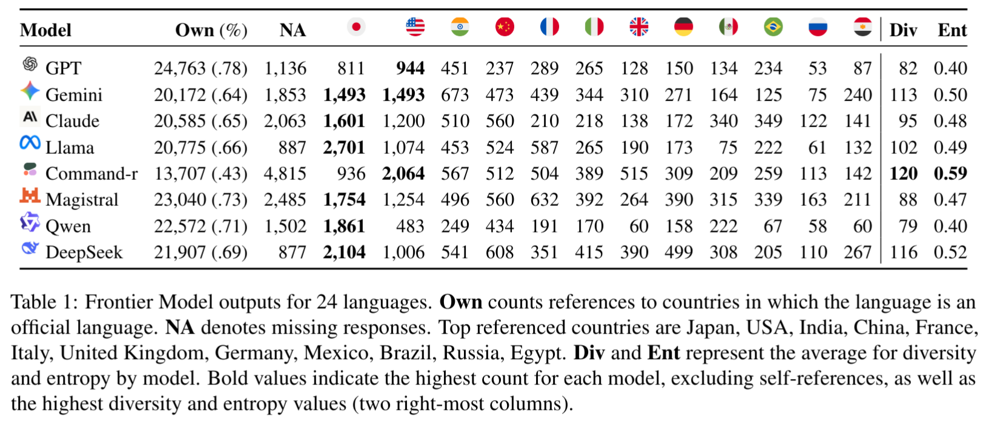
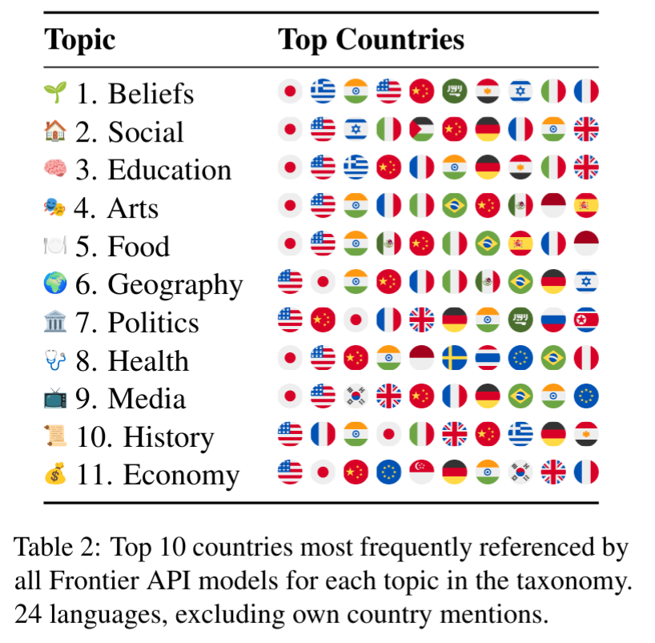
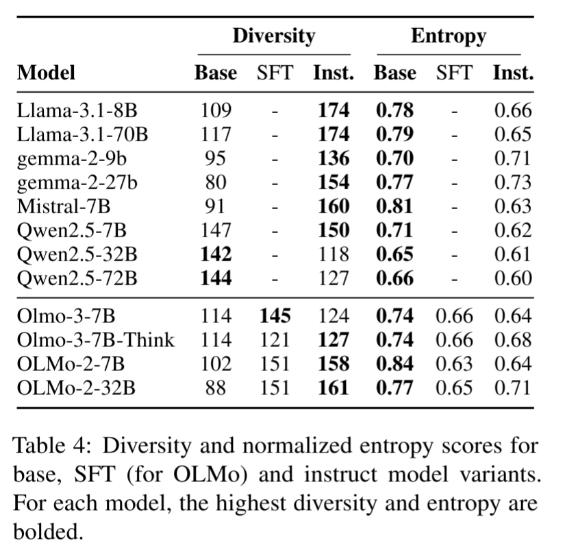

# Why are all LLMs Obsessed with Japanese Culture? On the Hidden Cultural and Regional Biases of LLMs

https://arxiv.org/abs/2604.21751
(まとめ @cohama)

# 著者
- Joseba Fernandez de Landa
- Carla Perez-Almendros
- Jose Camacho-Collados

HiTZ Center - Ixa, University of the Basque Country EHU, Cardiff University

# どんなもの？

- LLM の文化的・地域的バイアスを分析した論文
- LLM の文化的な能力ではなく、LLM がどの文化を好むのかという観点のデータセットを作成し分析
- 結果として日本文化を好んで回答する傾向があることを発見

# 先行研究と比べてどこがすごい？

LLM の文化バイアスに関する研究はこれまでも多くなされている。
例えば様々な文化圏に対する QA データセットによるベンチマークなど。この場合は LLM がリソースの少ない文化圏に対して弱いことが明らかになっている
しかし、これらの研究は文化的な知識に対する弱点は明らかにしているものの、クローズド回答形式のため LLM の自由な生成能力の評価としては限界がある。

本論文では単一の正解が存在しないオープンエンドな質問を用い、LLM にどの文化について回答させるかを選択させることにより、そこに存在するバイアスについて評価を行っている。

# 技術や手法の肝は？
## CROQ (Culture-Related Open Questions) データセット

11の上位ドメイン、66のサブトピックをもつ文化関連の質問を用意。
これらを24言語に翻訳。
質問は GPT-5.1 を使って生成したものを人間がチェック。

## 評価方法

CROQ データセットに対して、LLM に回答させる。ただし、末尾に `in region/place` というプレースホルダーをつけ、LLM にどに地域について回答させるかを選択させる。

この応答に対して別の LLM を使って、どの地域について回答されたかを抽出する。(最大5件)
信頼できない場合は推論不可能ラベルを付与する。

# どうやって有効だと検証した？

## 24 言語にわたる各モデルの国参照分布

まずは質問の言語と同じ地域を圧倒的に好む傾向がある。
一方で、自国以外では日本とアメリカが圧倒的に好まれる傾向がある。

## トピックごとの国参照分布 (自国以外)

日本とアメリカはすべてのカテゴリにおいて好まれる傾向がある。

## どの段階で文化の偏りが生じるか

instruction tuning 時にバイアスが入る傾向

# 議論はある
- 評価に LLM を使っているが、評価が正しく行われていな可能性
  - 著者らの知っている言語については人間のチェックもできるがそうでないものまで含めた大規模な人間評価は困難
- 評価対象言語は24言語のみ。これは全世界の言語 (約7000) に比べると非常に少なく、文化全体を代表するものでない

# 次に読むべき論文は？
